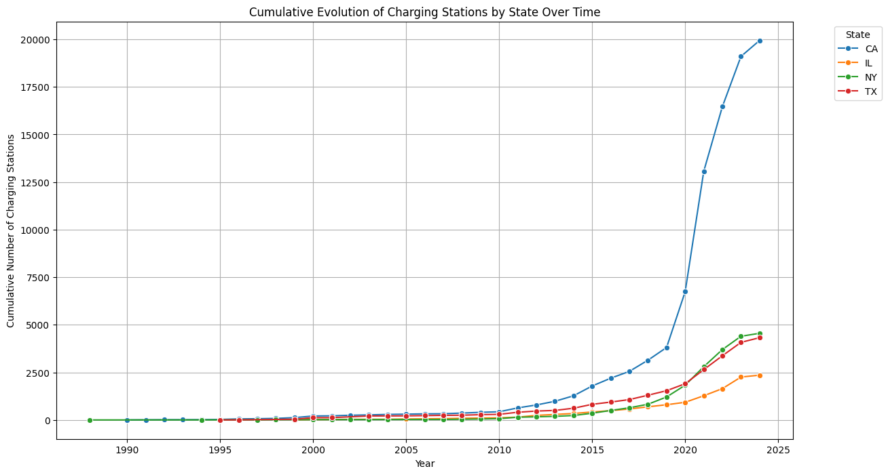
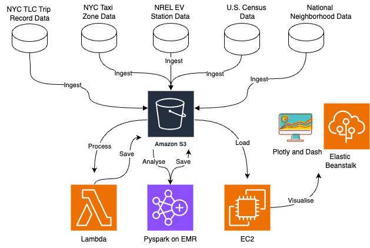
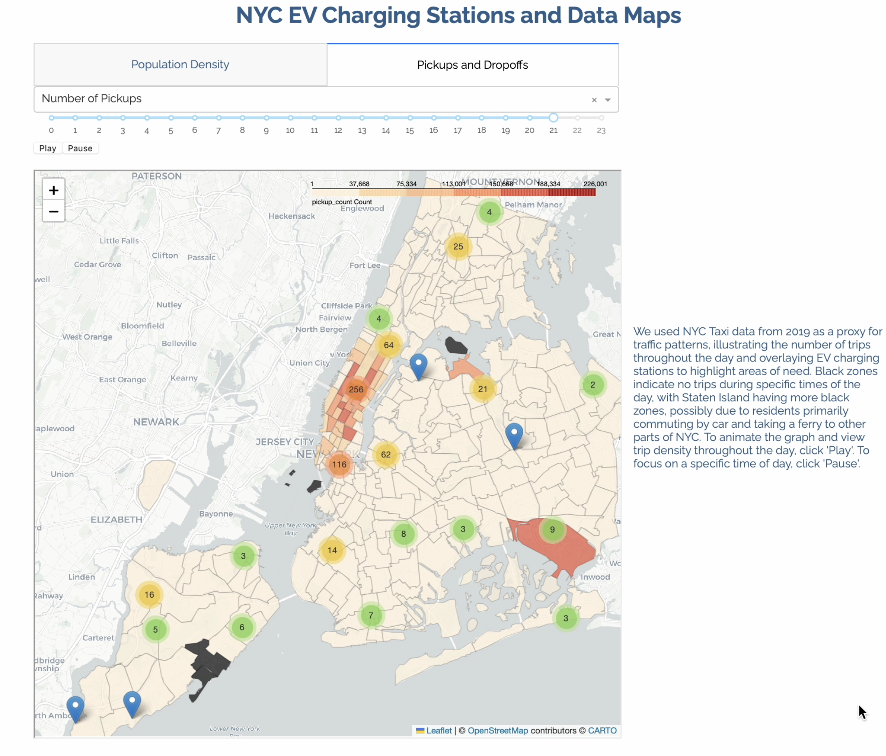
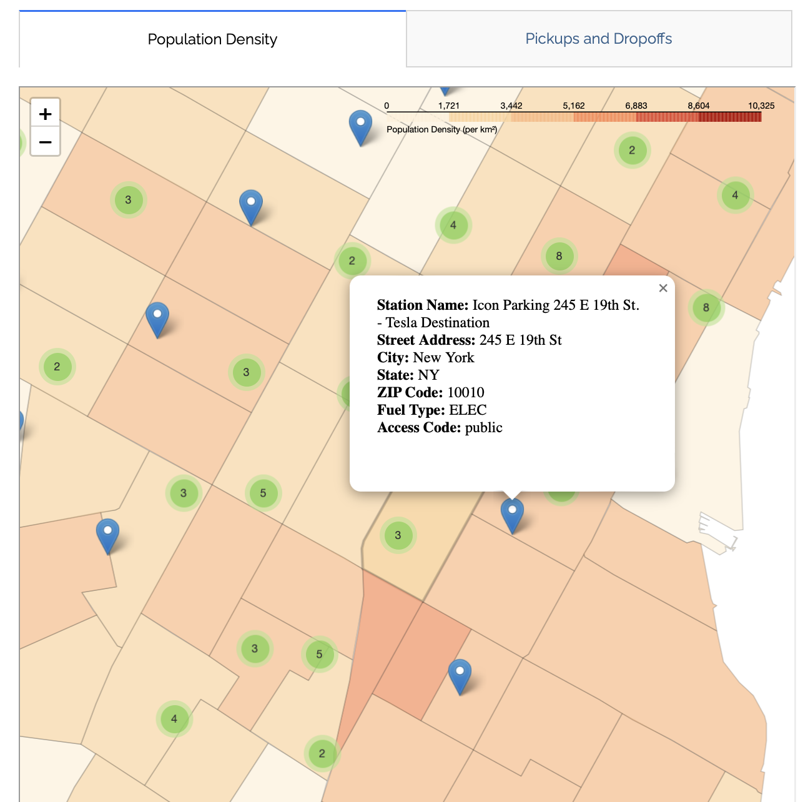

# Equitable Expansion of Electric Vehicle Charging Stations

Analysis of electric vehicle (EV) charging station locations in the context of current traffic, road density, and local population.

## Description

Analysis of electric vehicle (EV) charging station locations in the context of current traffic, road density, and local population. Analysis performed for Big Data And High Performance Computing for Social Scientists course (MACS 30113) course at the University of Chicago.

## Datasets Used
* 2019 New York City Taxi and Limousine Commission (TLC) Trip Record Data from AWS and NYC Open Data (https://registry.opendata.aws/nyc-tlc-trip-records-pds/)
* NYC Taxi zone data from NYC Open Data Portal https://data.cityofnewyork.us/Transportation/NYC-Taxi-Zones/d3c5-ddgc)
* Alternate Fuel station data from the National Renewal Energy Laboratory (NREL; https://developer.nrel.gov/docs/transportation/alt-fuel-stations-v1/)
* U.S. Census data on NYC population counts: This was obtained using an api call. Base url used was: https://api.census.gov/data/2020/dec/pl?get=P1_001N,NAME&for=tract:*&in=state:36&in=county:005,047,061,081,085&key={api_key}
* National Neighborhood Data Archive (NaNDA): Primary and Secondary Roads by Census Tract and ZIP Code Tabulation Area, United States, 2010 and 2020 (ICPSR 38585): https://www.icpsr.umich.edu/web/ICPSR/studies/38585

## Overview

#### Description of a social science research problem:

U.S. climate goals for economywide net-zero greenhouse gas emissions by 2050 will require rapid decarbonization of the light-duty vehicle1 fleet, and plug-in electric vehicles (PEVs) are poised to become the preferred technology for achieving this end (U.S. Department of Energy 2023). The speed of this intended transition to PEVs is evident in actions taken by government and private industry, both in the United States and globally. New PEV sales have reached 7%– 10% of the U.S. light-duty market as of early 2023 (Argonne National Laboratory 2023). Globally, PEV sales accounted for 14% of the light-duty market in 2022, with China and Europe at 29% and 21%, respectively (IEA 2023).

As established by the Infrastructure Investment and Jobs Act, also known as the Bipartisan Infrastructure Law, the Joint Office of Energy and Transportation (Joint Office) is setting the vision for a national charging network that is convenient, affordable, reliable, and equitable to enable a future where everyone can ride and drive electric. A barrier communities face in adopting the use of electric vehicles is a paucity of electric vehicle (EV) charging stations. Expanding the quantity and availability of EV charging stations is critical for enabling communities to switch from gas-powered vehicles to electric vehicles. 

Communities need to take a data-driven approach to determining how many EV chargers their communities need and where it would most serve their communities to install additional EV chargers. To examine a data-driven approach to answering this question, we will use New York City (NYC) as a case study. NYC presents a good opportunity for a case study because the City aims to reach carbon neutrality by 2050, has extensive and detailed datasets on for-hire vehicle traffic in the city publicly available via the NYC Open Data portal, and the City is currently undertaking and experimenting with an expansion of its EV infrastructure. EV charging station locations need to be equitably distributed, conducive to their convenient use by the communities they’re located in, and in places the electrical grid can sustain.

Our team conducted an analysis of the current distribution of electric vehicle charging stations in New York City. We produced visualizations to examine various factors that could help us determine the best locations for placing additional EV charging stations, such as how the distribution of EV charging stations compares to major thoroughfares, where the NYC population is located, and where NYC for-hire vehicle drivers are likely located. We determined which areas of NYC, defined by taxi zones, would be the best candidates for receiving the EV charging stations that are next installed in New York City. 


Certainly! Here is a more concise version in one paragraph:

Through our initial analysis of the EV charging stations data across four states—California, Illinois, New York, and Texas—we observed a significant increase in the number of charging stations over time, with California showing a remarkable growth trajectory that vastly outpaces the other states. This underscores California's commitment to advancing electric vehicle infrastructure. Our focus, however, is on New York City. The visualization below illustrates the evolution of charging stations over time and highlights the urgent need for expanding EV infrastructure in New York. By analyzing population density and existing charging station distribution, we aim to identify gaps and provide insights for optimizing the placement of new charging stations to better serve NYC residents.



#### Justification of the importance of using scalable computing methods to solve it:

This work uses New York City’s electric vehicle infrastructure as a case study for how electric vehicles can be strategically and equitably expanded. It’s important to use scalable computing methods for this work so that we are able to:
* analyze large datasets, such as the New York City taxi ride data, that we would not be able to analyze large portions of in the absence of scalable computing methods. This dataset is critical in determining the traffic flow in New York City and where it would be most useful to install EV chargers. 
* efficiently ingest and analyze numerous data sets into our model. Without scalable computing methods we would not have been able to integrate as many disparate data sources into our visualizations and model. 
* scale this work up to include the entire state of New York, additional states, additional cities the entire United States, and expanding to other countries.

#### Description of the scalable computing methods we employed in the project: 

Parts of this project are scalable and parts are not. Below we have listed each facet of the project, sorted by which parts are scalable and which are not. 



Ingestion - Scalable: 
* We used a lambda function and step function to ingest data from the National Renewable Energy Laboratory (NREL) and save it to an S3 bucket. This dataset provided us with the locations, longitude and latitude, of each EV charging station along with some additional information about each charging station. We would be able to ingest an even larger dataset using this code. 
* We used an API call to the NYC Open Data Portal to retrieve data on NYC taxi zones and saved this data to a S3 bucket as a parquet file. This data contains the shape files for each taxi zone and was used in combination with the location of the EV station location data to determine how many EV stations were located in each taxi zone. 
* We pulled 2019 NYC taxi ride data from an S3 bucket and saved aggregated versions of it to an S3 bucket as a parquet file. We would be able to ingest additional years of data using this code but limited this analysis to just 2019 to streamline the analysis and not have our analysis be impacted by outliers in the data caused by the 2019 pandemic. 

Ingestion - Not Scalable
* We used an API call to the U.S. Census to collect NYC population data. 
* We downloaded road data 

Analysis - Scalable:
* We used PySpark to analyze and aggregate 2019 NYC taxi ride trips. This part of the project would be able to be scalable since the analysis was conducted with PySpark.

Analysis - Not Scalable: 
* We used Pandas to analyze, merge, and aggregate multiple data sets
* [ESHAN IS ADDING]

Visualization - Scalable : 
* We used Plotly and Dash to create interactive visualizations for our analysis. These visualizations include scatter plots, bar charts, and maps that aid in understanding the population density, traffic and distribution and density of EV charging stations across NYC.
* By deploying our Dash application on AWS Elastic Beanstalk, we can ensure that our visualizations remains responsive and accessible even as the size of the dataset grows or as more users access the application simultaneously.


## References

* [Evidence from NASA in support of connection between human activity and climate change](https://science.nasa.gov/climate-change/evidence/)
* [Report on Electric Vehicles from NYC Mayor's Office of Climate and Environmental Justice](https://climate.cityofnewyork.us/subtopics/electric-vehicles/)
* [flo Web Page on NYC Public Charging](https://www.flo.com/new-york-city/)
* [Report on Electrifying the For-Hire Transportation Sector in NYC by NYC's Taxi and Limousine Commission](https://www.nyc.gov/assets/tlc/downloads/pdf/Charged_Up!_TLC_Electrification_Report-2022.pdf)
* [NYC Department of Transportation Web Page on Electric Vehicles](https://www.nyc.gov/html/dot/html/motorist/electric-vehicles.shtml#/find/nearest)
* [NYC Taxi and Limousine Commission Web Page on where to find EV chargers in NYC](https://www.nyc.gov/site/tlc/about/ev-charging-faq.page#/find/nearest)
* [Con Edison Web Page on EV Chargers in NYC](https://www.coned.com/en/our-energy-future/our-energy-vision/where-we-are-going/nyc-public-charging)


## Getting Started

### Directory Structure

```csharp
elec-transit-y
├── README.md
├── nyc_app.py
├── data
│   └── [data files]
├── media
│   └── [media files]
├── notebooks
│   ├── EV_eda.ipynb
│   ├── README.md
│   ├── census
│   │   ├── analysis
│   │   │   ├── census_viz.ipynb
│   │   │   └── pop_raster.ipynb
│   │   └── ingestion
│   │       └── census_population.ipynb
│   ├── ev_nrel
│   │   ├── README.md
│   │   └── ingestion
│   │       ├── lambda
│   │       │   ├── lambda_function.py
│   │       │   └── lambda_function.py.zip
│   │       └── nrel_ingestion.ipynb
│   └── nyc_taxi
├── poetry.lock
├── pyproject.toml
└── requirements.txt
```

### Running Visualizations

* 
* 


## Authors

Contributors names and contact info

* Jaskirat Kaur (jaskiratk@uchicago.edu)
* Eshan Prashar (eshanprashar@uchicago.edu)
* Jennifer Yeaton (jkyeaton@uchicago.edu)

## Version History

* 0.1
    * Initial Release (May 23, 2024)


